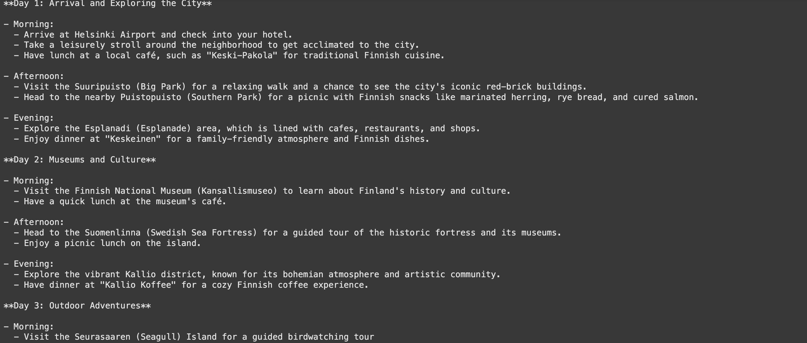
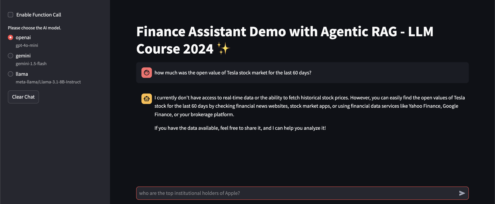

# Table of Contents
1. [Lab 01 : Tokenizers](#lab-01--tokenizers)
    1. [Tokenizers and Tokenization](#1-tokenizers-and-tokenization)
    2. [Importance of Tokenizers for Language Modeling and LLMs](#2-importance-of-tokenizers-for-language-modeling-and-llms)
    3. [Different Tokenization Algorithms](#3-different-tokenization-algorithms)
    4. [The Most Popular Tokenizers](#the-most-popular-tokenizers)
2. [Lab 02: Prompt Engineering](#lab-02-prompt-engineering)
    1. [Basic Prompt](#1-basic-prompt)
    2. [Zero Shot Prompt](#2-zero-shot-prompt)
    3. [One Shot Prompt](#2-one-shot-prompt)
    4. [Two Shots Prompt](#2-two-shots-prompt)
    5. [Chain of Thoughts (CoT)](#2-chain-of-thoughts-cot)
    6. [Conclusion](#conclusion)
3. [Lab 03 : LLM evaluation](#lab-03--llm-evaluation)


<div style="page-break-after: always;"></div>

# **Lab 01 : Tokenizers**
## 1. Tokenizers and Tokenization
A tokenizer is a method of breaking words into smaller parts called `tokens`. In English, suffixes, prefixes, and word stems can be examples of tokens. These tokens can be mapped into numerical values called `token ids` using a lookup table based on the language's vocabulary. When training a tokenizer from scratch, the vocabulary is built based on the tokenizer's algorithm and the training corpus. Some people refer to the words that remain as whole words after tokenization as tokens, and the parts of words that were divided as sub-tokens.

## 2. Importance of Tokenizers for Language Modeling and LLMs
Tokenization is a necessary step for any language model. Here are some of the most important aspects of tokenization for language models:

- **Machine's Language**: Machines cannot understand human language. The tokenizers translate a sequence of words into numerical IDs that can be fed to the language models.

- **Causal Language Modeling**: The whole mechanism of language models is based on predicting the next token given a sequence of previous tokens. Language models cannot predict a sentence as a whole at once; rather, they predict tokens sequentially based on the conditional probabilities of the previous tokens.

- **Pattern Recognition**: Some tokens can appear in more than one word, helping the models to construct a semantic pattern to understand words and build semantic relationships between words, such as words derived from the same root, verbs, adjectives, etc.

- **Self-Attention**: The success of LLMs is powered by the self-attention mechanism. LLMs compute the attention scores based on the token IDs produced by the tokenizer. For example, an LLM computes the scores of the sub-token "ing" in "language modeling." Poor tokens result in misleading attention scores.

- **Word Embeddings**: Large sequences of words can be divided into smaller tokens that models can learn meaningful embeddings from. With tokenization, each token can have its own embedding vector that represents its meaning in the semantic space. Different operations, such as semantic similarity, can be performed based on the embeddings of each token.

- **OOV Problem**: The vocabulary of language models, no matter how big it is, remains limited by a constant size. If a new word comes that does not exist in the vocabulary, the model will not be able to construct meaningful embeddings for it (Out-of-Vocabulary). However, with many tokenizers today (sub-word tokenizers), this problem is mitigated by breaking the new word into known tokens. If no known token is found in the vocabulary, the new word can be decomposed into a sequence of characters but never remains an unknown entity for the model.

## 3. Different Tokenization Algorithms

There are different types of tokenizers based on the algorithms used to break down a sequence of words into tokens. We can discuss three main tokenization methods:

1. **Word Tokenization**: Simply breaks down a sentence into words by splitting based on a certain separator (usually whitespace).
    - **Pros**: 
        - Easy to implement.
        - Requires no training.
        - Fast in computations.
    - **Cons**: 
        - Presents a challenge for agglutinative languages like Finnish, Hungarian and Turkish as one word can contain many information that need to be seperately handled by the model.
        - Results in a very large vocabulary that contains every word and all its possible derivations.

2. **Character Tokenization**: Breaks down a sentence into individual characters.
    - **Pros**:
        - Vocabulary size is small and equal to the number of characters in that language.
        - Useful for languages that do not have clear word boundaries, like some Asian languages (Chinese, Japanese...).
        - Easy to implement.
        - Requires no training.
        - Fast in computations.
    - **Cons**: 
        - It can be hard to capture semantic patterns between words. more effort is required for language models to be able to capture the co-occurence of some characters and the linguistic patterns.[^1]
        - The number of output tokens becomes very large when dealing with long texts. This may lead to information loss as it causes a challenge for language models as they have limited size input length.[^1]

3. **Sub-word Tokenization**: Breaks down sentences into tokens (either whole words or parts of words). It can be seen as a balance between word and character tokenization.
    - **Pros**: 
        - These tokenizers are built based on the linguistic characteristics of languages, which increases the probability of having meaningful tokens and sub-tokens that actually make sense. (If we look at the vocabulary of some tokenizers, we can see known prefixes, suffixes, and stems.)
        - Increases the ability of language models to build semantic patterns and understand the linguistic rules of a specific language.
        - Good at handling the OOV problem. 
    - **Cons**:   
        - Depends heavily on the training corpus. Having poor data, such as spelling errors, may result in a malformed vocabulary.
        - Struggles to represent rare words.
        - Difficulty in handling large numbers thus affecting the performance of large language models.[^2]

## The Most Popular Tokenizers
**The most commonly used tokenizers today are the sub-word tokenizers**, thanks to their ability to capture linguistic patterns that are crucial for language models. Some of the most popular ones are:

1. **Byte Pair Encoding (BPE)**: This algorithm starts by breaking down a corpus into words (this operation is known as pre-tokenization). After that, the words are decomposed into pairs of characters, and the frequency of each pair inside the corpus is computed. The most frequent pairs are added to the vocabulary as new elements. This process is repeated, and characters are merged sequentially based on their frequencies until a specific vocabulary size is reached.  
Byte-Level BPE is a popular tokenizer used by many LLMs today. 
The byte-level BPE is a subset of the BPE which uses bytes instead of characters. This is useful especially for a lot of unicode characters.

2. **WordPiece**: This method is similar to BPE in its working process. However, instead of merging pairs based on their frequencies inside the corpus, the algorithm maximizes the likelihood of the training data by computing the conditional probability of the pairs, dividing the frequency of the pair tokens appearing together by the frequencies of each token. It is used by some auto-encoder models like BERT, DistilBERT, and ELECTRA. The score of pairs is calculated as follows:
    
    `score=(freq_of_pair)/(freq_of_first_element×freq_of_second_element)`


3. **SentencePiece**: One problem that faces other algorithms is that they first pre-tokenize the text into a sequence of words (using white spaces generally) then tokenize the words further into tokens. However, this may cause problems as whitespace is not necessarily the real separator of words. Some languages, like Chinese, Korean and Japanese are non-segmented languages. As a solution, the SentencePiece tokenizer treats the text as a raw text stream composed of both spaces and characters. It then applies either the BPE or WordPiece algorithm.[^3] Many well-known models today, like LLaMA and Mistral, use the SentencePiece BPE tokenization method. 
A recent study[^4] showed that the BPE tokenizer implemented by the SentencePiece library outperformed the BPE implemented by the [Huggingface library](https://huggingface.co/)

<div style="page-break-after: always;"></div>

# **Lab 02: Prompt Engineering**

In this lab, different types of prompt techniques were evaluated. The following prompt was used as a "user" message to test the capabilities of the model with each prompting method: 
- USER_PROMPT: "I am traveling with my husband and my child to Helsinki for four days. Plan our trip."


## Experiements
For each experiment the "system" prompt was modified to control the model's behaviour. The temperature was set to 0.0 to ensure that the outputs are only affected by the prompt not by the randomness of the model. The following experiments were conducted: 
### 1. Basic Prompt 
The basic prompt used is: 
- SYSTEM_PROMPT: "You are a helpful and concise assistant."

This one will work as a baseline for other approaches. The model's response to the user prompt using Gemini's model was as shown in the picture below.

The response from Phi-3.5 mini model was:


We notice two major problems with the response:
1. The answer does not provide any information about the trip costs.
2. The tone of the answer is not professional.
With the Phi-3.5 mini model, the response was also longer than expected.
### 2. Zero Shot Prompt
Now we use a more customized prompt by adding a persona, a goal and a tone to the model. The new system prompt is:
```
ZERO_SHOT_PROMPT = You are a professional Travel Consultant. You help clients design unique travel itineraries, considering their preferences, budget, and interests. Your response should be consice and accurate.
```
However, the model could not answer at the first attempt. The model was affected by the prompt and therefore asks extra questions from the user to be able to generate a plan. The full answer from Gemini's model is shown below:


Fir Phi-3.5 mini model, there was no much difference between the basic prompt and the customized one. The full response was:


### 2. One Shot Prompt
The same system prompt used in zero-shot prompting was also used in this setting. By adding one QA pair example to the chat history, the model can be guided to generate a response that aligns more with the user's needs. The example used can be  found in `week-2/gemini-chatbot/prompts.env` file. The response of Gemini model to the user prompt is shown below:

The response from the Phi-3.5 mini model was:

The response now feels more formal, includes some rough cost estimations and provides a more detailed plan for the trip. 


### 2. Two Shots Prompt
This time we use two pairs of QA examples to guide the model. The examples used can be found in `week-2/gemini-chatbot/prompts.env` file. The response of the model to the user prompt is shown below:

The response from the Phi-3.5 mini model was:

We notice the the response is shorter than the one-shot prompt. The response aligns more with the provided examples.
### 2. Chain of Thoughts (CoT)
We tested another type of prompting to see how the model would respond. In addition to the prompt used in zero-shot prompting, a few sentences were added to encourage the model to consider wider oprions and evaluate each one. The full prompt is shown below:
```
You are a professional Travel Consultant. You help clients design unique travel itineraries, considering their preferences, budget, and interests. Your response should be consice and accurate. Think step by step before giving any suggestions. Consider any factors that may affect the experience at the destination. Think of many plans then choose the best ones. 
```


We can clearly see that the answer now contains more than one plan. Each plan considers different factors like thinking of children-friendly activities and the weather. the model also gives details about how accessible the places are. However details of the costs are now missing.
Whereas for Phi-3.5 mini model, the response included a whole section to consider various factors. Interestingly, all dinner suggestions are given for the same place. This could be due to the model's focus on the accessibility of the place and the family-friendly environment. The full response is shown below:


## Conclusion
Different prompting techniques affect the length, style and format of the model's response. Using a very basic prompt is risky as the model may not adhere to the desired format or give the required information. Few-shot prompting gave the best responses because it guides the model to generate more customized responses that align with the user's needs. The Chain of Thoughts (CoT) method can help the model to consider different factors and generate more detailed responses. However, the model may still need more guidance to follow the desired format and provide all the required information.


N.B. Please check the notebooks on this repository to get access to the answers of other tasks like using Phi-3.5 mini model. For the in-context learning notebook, the codes were changed to use a huggingface model. Though the model chosen was small in size, the computation resources offered by Google Colab were not enough to generate the summaries due to the length of the prompts. 

<div style="page-break-after: always;"></div>

# **Lab 03 : LLM evaluation**

Large Language Models are trained using huge amounts of data. This data is usually taken from publicly available sources on the internet. The data can also reflect the culture and norms of a specific group of people. For example a model trained on Turkish data will learn a lot about Turkish traditions and culture. This can also affect the way these LLMs do reasoning and generate text. Another important aspect is the data bias. If the data is biased, the model will probably also be biased. 

Multilingual models are trained on data from multiple languages. This can be beneficial as the model can learn from different cultures and norms. However, will the same model generate the same response for the same prompt in different languages? Does this change from one model to another? In this report, we try to explore how the language of the prompt affects the response of the model. We use two multilingual models for this purpose. The first model is the open-source model [Qwen/Qwen2.5-1.5B-Instruct](https://huggingface.co/Qwen/Qwen2.5-1.5B-Instruct) that is scoring very high on the [Open LLMs Leaderboard](https://huggingface.co/spaces/open-llm-leaderboard/open_llm_leaderboard)
The second model is Google's [gemini-1.5-flash](https://deepmind.google/technologies/gemini/flash/) model.
Through this experiment, we aim to evaluate the response of the model from two different perspectives:
- Cross-Lingual Test: How the same model responds to the same prompt in different languages?
- Cross-model Test: How different models respond to the same prompt in the same language? 

Please refer to the notebook for more details on the experiments' details and the used prompts.

<div style="page-break-after: always;"></div>

# **Lab 04: DPO Finetuning**

The model "Qwen/Qwen2-1.5B-Instruct" was fine-tuned using DPO learning. The objective of the training was to make the LLM sound more human. The dataset used in this task is [HumanLLMs/Human-Like-DPO-Dataset](https://huggingface.co/datasets/HumanLLMs/Human-Like-DPO-Dataset). Due to computation requirements, the training was not possible on Google Colab, the training was done on the cloud provider [RunPod](https://www.runpod.io/) using the `RTX 6000 Ada` GPU machine. The batch size used was 16 and the training was limited to 200 training steps. The training was tracked using Wandb platform. The rewards for the rejected answers was continously decreasing whereas the rewards for the accepted answers was increasing. However, the training loss was decreasing gradually until reaching almost zero after 50 training steps. This indicates a possible overfitting. The charts from wandb are attached below:


TO tackle this problem a few changes to the training parameters were done. The learning rate was decreased to 1e-5 and the training steps were increased to 500. THe beta value was also increased from 0.1 to 1 to strenghthen more the influence of the preference. The training was done again. 

The charts from wandb are attached below:


<div style="page-break-after: always;"></div>

# **Lab 05: Agentic RAG (Task 03)**
In this lab, we explore the use of different LLM agents to power a finance assistant chatbot. The chatbot is designed to provide detailed responses to user queries about a company's stock information, sustainability scores, and institutional holders. Additionally, it can visualize stock prices using the charts of the Streamlit UI. Each function can be thought of as a specialized agent, tailored to handle specific tasks. External information is provided from the Yahoo Finance API and integrated into the chatbot as contextual data to support accurate and relevant responses. We tested three models in this setup: the OpenAI model gpt-4o-mini, which has access to all the specialized functions; and the Gemini and LLama models, which function as baseline "vanilla" models without tool access. Notably, classic retrieval-augmented generation (RAG) approaches are unsuitable for this task because they rely on static data, whereas real-time financial information is essential for accuracy.
LangSmith was used to track the calls of different agens (functions) and the final response.

1.  **Use Case 01: Company Shareholder Information:**
    - Without RAG: The model's answer is bound by its limited knowledge cutoff up to Ovtober 2023. The answer is not up-to-date and lacks the numerical values of the shares.
    
    - With RAG: The model's answer is more detailed and up-to-date (up to the last update of March 2024). It provides the numerical values of the shares and the percentage of the shares held by the institutional holders. We also notice that the order of the shareholders is different from the previous answer.
    
    

2. **Use Case 02: Company Sustainability Scores:**
    - Without RAG: The model's answer focuses more on the general information about the company's sustainability efforts and vision. The information provided gives more positive feedback about the company's sustainability efforts.
    
    
    - With RAG: The model's answer is more detailed and backed by numerical values. The evaluation of the company's sustainability scores is more critical and shows the company's weaknesses in some areas.
    
  
3. **Use Case 03: Company Stock Information:**
    - Without RAG: The model could not retrieve any information about the stock information
    
    - With RAG: The model's answer is accurate and plots the stock price chart for the user.
    


# **Lab 06: GraphRAG (Task 04)**

<div style="page-break-after: always;"></div>

# References

[^1]: Toraman, C., Yilmaz, E. H., Şahinuc, F., & Ozcelik, O. (2023). Impact of tokenization on language models: An analysis for Turkish. *ACM Transactions on Asian and Low-Resource Language Information Processing*, 22(4), Article 116. [https://doi.org/10.1145/3578707](https://doi.org/10.1145/3578707)

[^2]: Exploring Byte Pair Encoding (BPE). [https://www.linkedin.com/pulse/exploring-byte-pair-encoding-bpe-premai-znv8f/](https://www.linkedin.com/pulse/exploring-byte-pair-encoding-bpe-premai-znv8f/)

[^3]: Summary of Tokenizers. Hugging Face Documentation. [https://huggingface.co/docs/transformers/en/tokenizer_summary#summary-of-the-tokenizers](https://huggingface.co/docs/transformers/en/tokenizer_summary#summary-of-the-tokenizers)

[^4]: Ali, M., Fromm, M., Thellmann, K., Rutmann, R., Lübbering, M., Leveling, J., Klug, K., Ebert, J., Doll, N., Buschhoff, J. S., Jain, C., Weber, A. A., Jurkschat, L., Abdelwahab, H., John, C., Suarez, P. O., Ostendorff, M., Weinbach, S., Sifa, R., … Flores-Herr, N. (2023). Tokenizer Choice For LLM Training: Negligible or Crucial? (Version 4). *arXiv*. [https://doi.org/10.48550/ARXIV.2310.08754](https://doi.org/10.48550/ARXIV.2310.08754)


